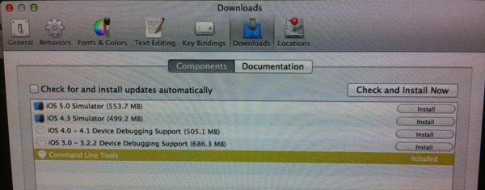

# Arduino, Ruby &amp; Sinatra - The Internet Of Things's Rat Pack

Frank, Sammy &amp; Dean were a great team known as the "Rat Pack". What's true for these fellows is also true for Sinatra, Ruby and Arduino: put them together for instant awesomeness!

If you connect the strengths of these three mates, you're able to turn household objects into social objects. Examples range from the amazing talkative ping pong table a.k.a. [Occupy Ping Pong!](https://github.com/makersandco/Occupy-Ping-Pong) Makers & Co. did in cooperation with an Advertising School, over the digital foosball table I prototyped for an agency last year to the [Empathic Servo](https://vimeo.com/27113323) which uses Ruby logic to translate between a face recognition software, the serial port and a servo motor.

To put it short: the Internet of Things is rising and although being a hardware centric concept it still needs some middleware <3 to negotiate. That's where Arduino (Dean), Sinatra (Frank) and Ruby (Sammy) get together for rapid prototyping and instant awesomeness!

## Episode I - The Workshop

This is the workshop we're having [here](http://www.meetup.com/hacktable/events/57399932/). It goes a little like this:

### 1 - Plain Old Button

Use Sven's lovely advices and [this](https://github.com/5v3n/ratpack-theworkshop/zipball/step-1-plainbutton) information to get a Plain Old Button working. It's basically the Arduino button example code plus a hand crafted Fritzing sketch of the wiring that makes a LED light up when we do so.

### 2 - Plain Old Internet Connection

Use Sven's lovely advices and the Arduino Ethernet or [WiFly](https://github.com/timr/WiFly-Shield) library's 'web client' example to get a Plain Old Internet Connection working.

For Arduino 1.0+ that we are using, mind the updated Wifly library version linked above.

### 2.5 – setting up your system (wip!)

> "Trust me. I know what I'm doing." ––Sledge Hammer

Here are the things that need to be installed on your OS X and where you can find them. Please note that order *does* matter. If you have never used a terminal before, don't do this alone :)

1. [Apple developer tools](https://developer.apple.com/technologies/tools/). The **command line tools** need to be installed, too:

    

    **update**: there is [a much smaller package, precompiled for 10.6 and 10.7](https://github.com/kennethreitz/osx-gcc-installer/) (found at the [railsgirls install guide](http://guides.railsgirls.com/install))

2. [Rubygems](http://rubygems.org/pages/download). Download the .zip, unpack it, then follow the readme.

3. [Bundler](http://gembundler.com/)

        $ gem install bundler

4. An [account at Heroku](https://api.heroku.com/signup) and the [Heroku Toolbelt](https://toolbelt.heroku.com/) (which conviniently includes [git](http://git-scm.com/)).

5. [Homebrew](https://github.com/mxcl/homebrew/wiki/installation)

5. [RVM (Ruby Version Manager)](https://rvm.io/) and a newer ruby (and maybe set that to default while we're at it):

        $ curl -L get.rvm.io | bash -s stable
        $ rvm install 1.9.3
        $ rvm --default use 1.9.3
    

##### clone repo

    $ mkdir ~/ratpack
    $ git clone https://github.com/5v3n/ratpack-theworkshop.git ~/ratpack
    $ cd ~/ratpack
    $ bundle install

##### [create a new heroku app](https://devcenter.heroku.com/articles/creating-apps) on the cedar stack and push it

your new child, sorry, app needs a name. just make one up. then type:

    $ heroku create name_of_your_app --stack cedar

and push it:

    $ git push heroku master
    

if everything went right, you should be able to reach `name_of_your_app.heroku.app` with your browser.

### 3 - Sinatra Takes The Stage

We're close to the magic now. [Sinatra](http://www.sinatrarb.com/) is a Ruby library that lets you negotiate between stuff that is online using the verbs of the internet. In more basic terms its a ruby gem offering a domain specific language that enables you to build RESTful web services on top of the ruby middleware rack.

Our stage is [Heroku](http://heroku.com) which is a hosting service where we may let Sinatra perform for free. That is free as in free beer as long as you don't plan to get drunk since it's going to be awful expensive if you order a second one. Just kidding, I <3 heroku and all my apps were or are bootstrapped there.

[...bla bla writing on process...]

Repo revision with the ready server can be found [here](https://github.com/5v3n/ratpack-theworkshop/zipball/step-2-onlinebutton). It uses one Arduino with a Wifly board. To use it with two independent devices (e.g. one on Hamburg, one in Hong Kong) just build another one, they'll interact just nice. Just connect them to the same ratpack server.

### 4 - Ladies &amp; Gentlemen - The RAT PACK!

Here's a roundup of the workflow we just established. We are able to...

- push the button (Arduino)
- tell the server we did so (Arduino - Sinatra)
- tell the server to tell all interesed devices that we did so (Ruby)
- let all interested devices' LEDs light up. globally. (Arduino)
- it's ALIVE!!!! ZOMG!1!!11!! (Hacktable attendees freaking out)

## Episode II - The Talk

coming soon - feel free to vote for the [Euruko 2012 talk proposal](https://github.com/euruko2012/call-for-proposals/pull/60)!